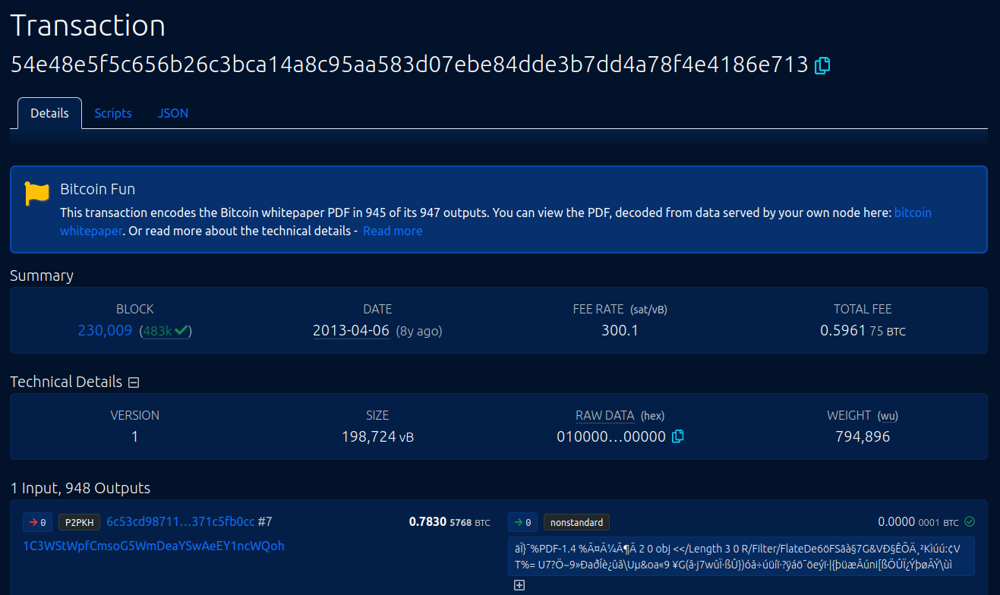

## Bonus guide: Download the bitcoin whitepaper directly from your own blockchain
{: .no_toc }

---

Download the Bitcoin white paper PDF directly from the blockchain data on your own node and witness the power of a decentralized network to fight censorship. 

Difficulty: Easy
{: .label .label-green }

Status: Tested v3
{: .label .label-green }



---

Table of contents
{: .text-delta }

1. TOC
{:toc}

---

### Introduction

The Bitcoin white paper PDF was encoded in the blockhain in April 2013, in transaction `54e48e5f5c656b26c3bca14a8c95aa583d07ebe84dde3b7dd4a78f4e4186e713` of block `230,009`.  

The transaction contains 947 outputs and the sender spent almost 60 millions sats as miner fee! Some explanations on how the paper is encoded in the transaction is given in a [Bitcoin stackexchange post](https://bitcoin.stackexchange.com/questions/35959/how-is-the-whitepaper-decoded-from-the-blockchain-tx-with-1000x-m-of-n-multisi/35970#35970){:target="_blank"} from 2015.  

This guide explains how to reconstruct the Bitcoin white paper PDF using data from your own verified blockchain. No matter how censored the white paper could become (e.g. see [here](https://bitcoinmagazine.com/business/copa-suing-craig-wright-over-bitcoin-white-paper-claims){:target="_blank"}), you will know how to recreate and share the foundational document of Bitcoin.

---

### Download the PDF

* With the "admin" user, create a new directory to store the PDF and move to this directory

  ```sh
  $ mkdir bitcoin-white-paper
  $ cd bitcoin-white-paper
  ```

* Use `bitcoin-cli` to download and create the PDF

  ```sh
  $ bitcoin-cli getrawtransaction 54e48e5f5c656b26c3bca14a8c95aa583d07ebe84dde3b7dd4a78f4e4186e713 true | jq -r '.vout[].scriptPubKey.asm' | cut -c3- | xxd -p -r | tail +9c | head -c 184292 > bitcoin.pdf
  $ ls -la
  > bitcoin.pdf
  ```

---
  
### Send the PDF to your desktop computer (Linux only)
  
To be read, the PDF can now be sent from the remote node to your local computer using the [scp](https://www.man7.org/linux/man-pages/man1/scp.1.html){:target="_blank"} utiliy. The following command only works on Linux-based computers.

* On your local computer, open a terminal window and type the following command. Replace YourNodeIP with the Raspberry Pi IP address (or raspibolt.local if it works) and do not forget the dot at the end of the line (representing the destination of the file, here the 'Home' folder of your local computer).

  ```sh
  $ scp admin@YourNodeIP:~/bitcoin-white-paper/bitcoin.pdf .
  ```
  
* The file should now be located in the Home folder of your local computer (e.g. /home/<username>)>
  
### Send the PDF to your Telegram account

🚨 **Privacy warning**: Using this method will leak your IP address to the Telegram server.

* Follow [this tutorial](https://www.shellhacks.com/telegram-api-send-message-personal-notification-bot/){:target="_blank"} to create a new Telegram bot (up to, and including, 'Get the Chat ID'). Write down the bot ID and the chat ID in a secure location (e.g. in your password manager).

* Send the white paper to your bot (replace YourChatID and YourBotID by respectively your chat and bot ID obtained from the previous step). It might takes a few seconds.

  ```sh
  $ curl -v -F "chat_id=YourChatID" -F document=@/home/admin/bitcoin-white-paper/bitcoin.pdf https://api.telegram.org/botYourBotID/sendDocument
  ```
  
* The PDF should now be available for download in your Telegram bot.
  
---

### Create a bash script 

A bash script can be used to automatically download and send the pdf to your Telegram bot.

* Still with user "admin", create a new file in the '~/bitcoin-white-paper' directory and paste the following lines (replace YourChatID and YourBotID with your own IDs). Save and exit.

  ```sh
  $ cd ~/bitcoin-white-paper
  $ nano white-paper.sh
  ```
  
  ```ini
  #!/usr/bin/bash
  bitcoin-cli getrawtransaction 54e48e5f5c656b26c3bca14a8c95aa583d07ebe84dde3b7dd4a78f4e4186e713 true |
  jq -r '.vout[].scriptPubKey.asm' | cut -c3- |
  xxd -p -r | tail +9c | head -c 184292 > bitcoin.pdf

  curl -v -F "chat_id=YourChatID" -F document=@/home/admin/bitcoin-white-paper/bitcoin.pdf https://api.telegram.org/botYourBotID/sendDocument
  ```
  
* Make the file an executable

  ```sh
  $ chmod +x white-paper.sh
  ```

* To download and send the pdf to the Telegram bot, execute the script with user "admin"

  ```sh
  $ ~/bitcoin-white-paper/white-paper.sh
  ```

---
  
### Trivia: Read the paper in the BTC-RPC-Explorer 

The BTC-RPC-Explorer has also a functionality to extract the data from the node and display the PDF in the web browser.
* Open your explorer#
* Look-up the transaction ID in the explorer: `54e48e5f5c656b26c3bca14a8c95aa583d07ebe84dde3b7dd4a78f4e4186e713`
* Click on the link "bitcoin whitepaper" in the top box, this will generate the pdf from the node blockchain and displays it as a pdf file in the browser.
* Alternatively, use the following URL: http://<node_IP>:3002/bitcoin-whitepaper
  
---

<< Back: [+ Bitcoin](index.md)
